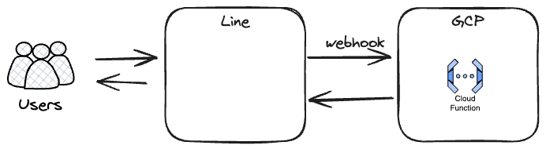

## architecture



## Line友だち追加


## 環境変数
`src/.env.yaml`
```yaml
LINE_CHANNEL_ACCESS_TOKEN: CHANNEL_ACCESS_TOKEN
LINE_CHANNEL_SECRET: CHANNEL_SECRET
```


## requirements.txt の生成
```bash
poetry export -f requirements.txt --output src/requirements.txt --without-hashes
```


## デプロイ
```bash
gcloud functions deploy function-1 --runtime python311 --trigger-http --allow-unauthenticated --source=src --env-vars-file=src/.env.yaml
```